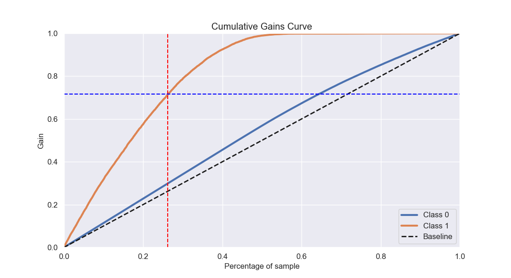
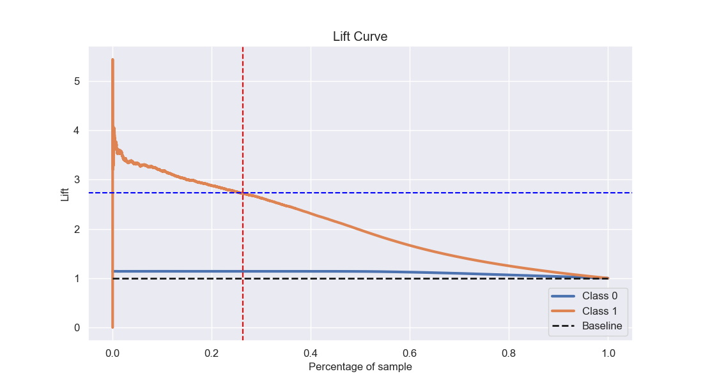
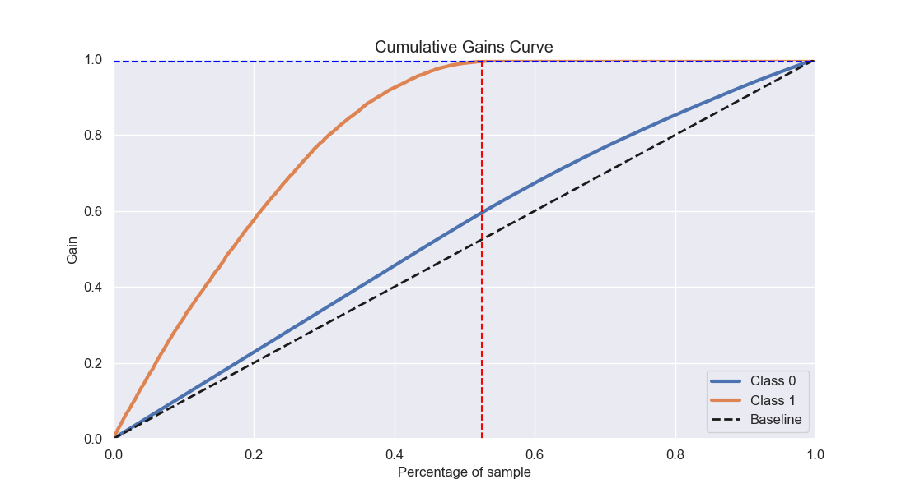
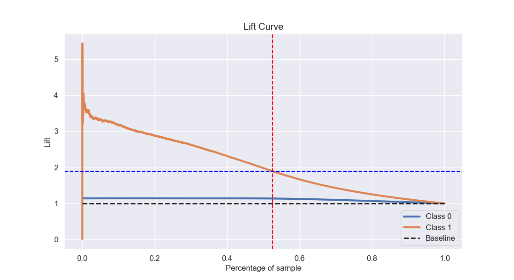
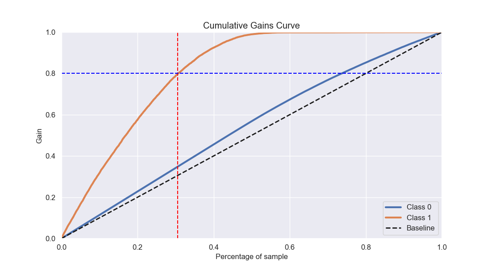
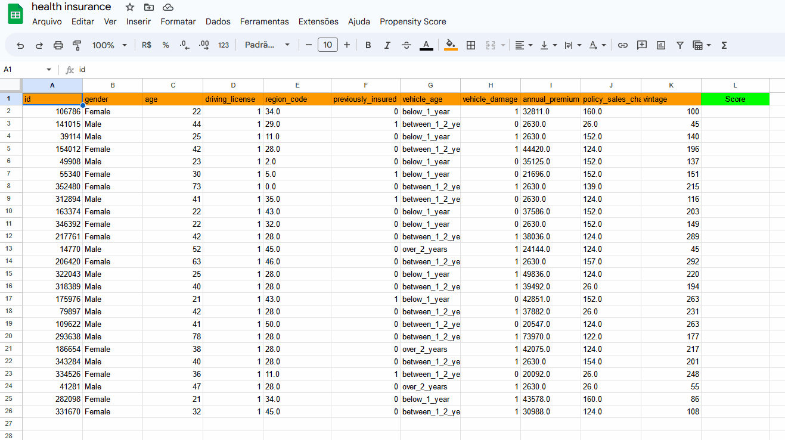

# Propensão de Compra - Insurance Company

# Problema de Negócio
Uma companhia que oferece plano de saúde aos clientes esta avaliando a possibilidade de oferecer um novo produto: o seguro veicular, e para isso eles precisam saber quais os melhores clientes para oferecer esse produto. Como cientistas de dados fomos contratados para  ajudar o time de produto com uma solução, sabendo que a empresa só a capacidade de fazer 20000 ligações para oferecer o novo seguro. 
Para prever se o cliente estaria interessado no seguro veicular, temos informações sobre dados demográficos, veículos, apólice e também a informção de uma pesquisa da empresa com seus clientes sobre o interesse em adquirir o novo seguro.
# Premissas do Negócio
O dataset com os dados que usaremos nesse projeto apresenta as seguintes features:

|Variável|Definição|
| -- | -- |
|id|Identificador único por cliente|
|Gender|Gênero do cliente|
|Age|Idade do cliente|
|Driving_License| 0: cliente sem habilitação, 1: cliente com habilitação|
|Region_Code|Código único da região do cliente|
|Previously_Insured|1: Cliente já tem seguro veicular, 0: Cliente não tem seguro veicular|
|Vehicle_Age| Idade do veículo|
|Vehicle_Damage|1: Cliente já teve o veículo danificado, 0: Cliente nunca teve o veículo danificado|
|Annual_Premium|O valor que o cliente precisa pagar por ano|
|Policy_Sales_Channel|Código anonimizado para o canal de contato com o cliente|
|Vintage|Tempo em dias que o cliente está associado à empresa|

# Estratégia da Solução
O produto final para ajudar a empresa a entrar em contato com os melhores clientes será uma funcionalidade no Google Sheets que tendo uma lista de clientes e suas informações, retorna uma lista ordenada pela propensão de comprar o novo seguro.

A estratégia para fazer esse projeto teve como base a metodologia CRISP-DS tendo como primeiro ciclo as etapas descritas abaixo:

**Questão de negócio:**
* Problema de negócio a ser resolvido.
  
**Entendimento do Negócio:**
* Entender a motivação do time de negócio e a causa raiz do problema, propor o formato de entrega da solução. 

**Coleta de Dados:**
* Coletar os dados do banco de dados da empresa. Para este projeto será feita a importação dos dados em um arquivo .csv vindo da plataforma Kaggle.

**Limpeza dos Dados:**
* Fazer a descrição dos dados, checar e preencher valores faltantes, verificar dados duplicados, fazer a transformação adequada de tipo das variáveis.

**Exploração dos Dados:**
* Compsta de 3 passos: Feature Engineering, que envolve a criação das hipóteses de negócio, criação e ajuste de features necessárias para validar as hipóteses;
* Filtragem de variáveis, onde são selecionadas as features com base na disponibilidade;
* Análise Explorátoria dos Dados(EDA) onde é feita a análise univarada para ver a distribuição de cada feature, também é feita a analise bivariada para validar as hipóteses e gerar insights, e análise multivariada para analisar a correlação das variáveis.

**Modelagem dos Dados:**
* Separar dados de treino e validação
* Fazer a padronização ou reescala de acordo com o tipo de distribuição de cada variável. Transformar as variáveis categóricas em numéricas.
* Fazer a seleção de features mais relevantes para o modelo e comparar com as que foram mais importantes na EDA
* Definir as features que serção usadas para treinar os modelos

**Algoritmos de Machine Learning:**
* Treinar os modelos de Machine Learning nos dados preparados.
* Comparar a performance dos algoritmos e escolher o melhor.
* Definir os melhores hiperparâmetros para o algoritmo escolhido.

**Avaliação do Algoritmo:**
* Responder as perguntas de negócio.
* Avaliar a performance do modelo na forma de resultados financeiros, comparando com resultado sem o modelo.

**Modelo em Produção:**
* Criar as classes com todos os processos necessarios para aplicar nos dados em produção
* Testar a API localmente
* Publicar a API na nuvem (Render)
* Criar o script que usa o modelo para rankear os clientes no Google Sheets

# Top 3 Insights
Foram criadas 10 hipóteses para validação. As 3 principais geraram os insights abaixo:

| Insight 1 - Mulheres tem menor interesse pelo seguro |
| -------- |
|  |

| Insight 2 - A faixa de idade com maior interesse pelo seguro é entre 30 e 50 anos |
| -------- |
|  |

| Insight 3 - O interesse pelo seguro é maior por quem tem veiculos mais velhos |
| -------- |
|  |

# Modelos de Machine Learning
Os 5 algoritmos selecionados para esse projeto foram:
1. K-Nearest Neighbors.
2. Extra Trees.
3. Random Forest.
4. XGBoost.
5. CatBoost.
6. LGBM

Os resultados dos modelos aplicando o metodo de cross validation foram os seguintes:

|Modelo|Precision at k|Recall at k|
|------|--------------|-----------|
|LightGBM Classifier|0.3099+/- 0.0013|0.8295+/- 0.0035|
|CatBoost Classifier|0.3092+/- 0.0016|0.8274+/- 0.0043|
|XGBoost Classifier	|0.3082+/- 0.0013|0.8249+/- 0.0036|
|Random Forest Classifier|0.2922+/- 0.0009|0.7819+/- 0.0025|
|ExtraTreesClassifier|0.2875+/- 0.0014|0.7693+/- 0.0037|
|LogisticRegression|0.2759+/- 0.001|0.7383+/- 0.0026|
|KNeighborsClassifier|0.272+/- 0.0011|0.7279+/- 0.0029|

A métrica para escolher o modelo foi a Precision at k que mede a precisão  nos primeiros k itens da lista. O modelo com a maoir precisão foi o **LGBM**. 

Após fazer a busca pelos melhores hiperparâmetros o modelo LGBM apresentou o resultado abaixo:

|Modelo|Precision at k|Recall at k|
|------|--------------|-----------|
|LightGBM Classifier|0.3105+/- 0.0014|0.8311+/- 0.0038|

# Resultado de Negócio
A seguir são respondidas perguntas de negócio que o time de produto solicitou.
**1. Qual porcentagem de clientes interessados em comprar o seguro veicular o time de vendas pode alcançar fazendo 20000 ligações?**

Fazendo 20000 ligações, que representam 26,23% dos dados, o time de vendas consegue alcançar 71,7% de pessoas interessadoasno novo seguro. O modelo é 2,73 vezes melhor que o modelo aleatório.

**2. E se o time de vendas aumentasse a capacidade de ligações para 40000, qual a porcentagem de clientes interessados no seguro veicular eles iriam alcançar?**

Fazendo 40000 ligações, que representam 52,47% dos dados, o time de vendas consegue alcançar 99,3% de pessoas interessadoasno novo seguro. O modelo é 1,89 vezes melhor que o modelo aleatório.

**3. Quantas ligações o time de vendas precisa fazer para alcançar 80% dos clientes interessados no seguro veicular?**

Fazendo 23247 ligações, o time de vendas alcança 80% dos interessados no seguro veicular.
## Resultados Financeiros
Para fazer uma estimativa do resultado financeiro usando o modelo assumi a premissa de que o lucro com cada cliente é de 1600 dólares. 
Questão 1
* Receita anual com o modelo aleatório fazendo 20000 ligações: U$3,920,000.00
* Receita anual com o modelo sugerido fazendo 20000 ligações: U$10,716,800.00

Questão 2
* Receita anual com o modelo aleatório fazendo 40000 ligações: U$7,841,600.00
* Receita anual com o modelo sugerido fazendo 40000 ligações: U$14,841,600.00

Questão 3 
* Receita anual com o modelo aleatório fazendo 23247 ligações: U$4,558,400.00
* Receita anual com o modelo sugerido fazendo 23247 ligações: U$11,956,800.00

# Produto Final
Para ter a lista ordenada por propensão, o usuario da ferramenta precisa inserir os dados do cliente, clicar em 'Propensity Score' e depois em 'Get Prediction'. Em alguns segundos o Google Sheets irá fazer uma requisição na api com o modelo treinado e retornar a lista ordenada.

# Conclusão
O objetivo do projeto, que era entregar uma lista ordenada pelos melhores clientes para oferecer o produto, foi cumprido. As perguntas do time de produto foram respondidas e poderam direcionar a tomada de decisão nesse novo desafio de vendar seguro vaicular.

Além da lista ordenada, com os insights apresentados nesse projeto o time de produto pode ter novas ideias para melhorar o negócio.

# Próximos passos
* Pensar em mais hipóteses para gerar outros insights.
* Testar novos modelos e novos metodos de fine tuning.
* Criar novas features que possam ajudar o modelo.
* Aplicar transformações diferentes nos dados e avaliar se melhoraria a performance.

