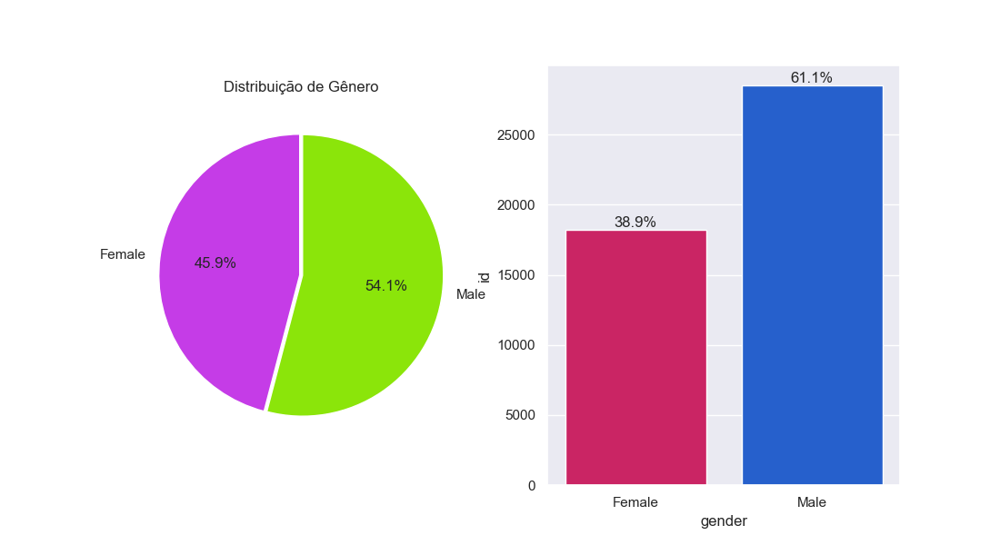
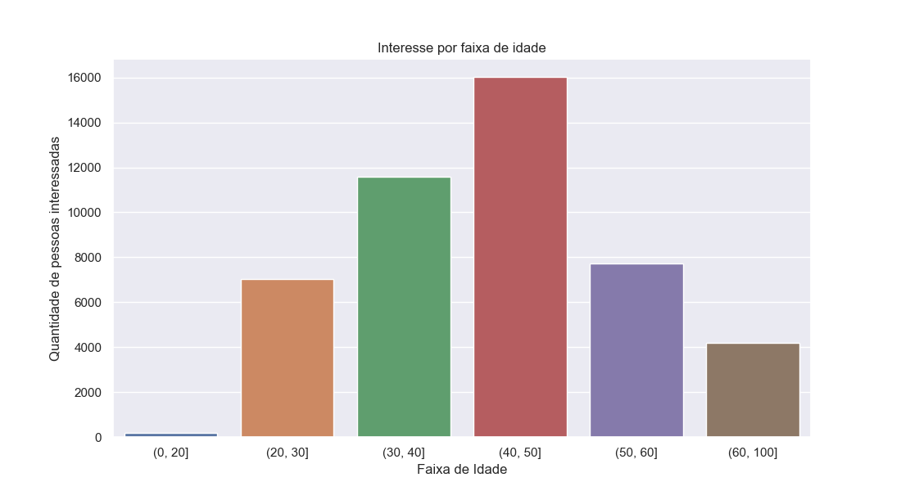
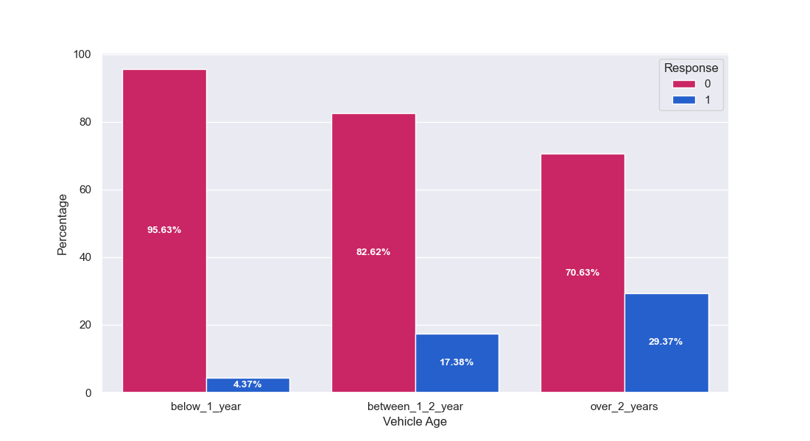

# Propensão de Compra - Insurance Company
-------IMAGEM-----
# Problema de Negócio
Uma companhia que oferece plano de saúde aos clientes esta avaliando a possibilidade de oferecer um novo produto: o seguro veicular, e para isso eles precisam saber quais os melhores clientes para oferecer esse produto. Como cientistas de dados fomos contratados para  ajudar o time de produto com uma solução, sabendo que a empresa só a capacidade de fazer 20000 ligações para oferecer o novo seguro. Para prever se o cliente estaria interessado no seguro veicular, temos informações sobre dados demográficos, veículos, apólice e também a informção de uma pesquisa da empresa com seus clientes sobre o interesse em adquirir o novo seguro.
# Premissas do Negócio
O dataset com os dados que usaremos nesse projeto apresenta as seguintes features:

|Variável|Definição|
| -- | -- |
|id|Identificador único por cliente|
|Gender|Gênero do cliente|
|Age|Idade do cliente|
|Driving_License| 0: cliente sem habilitação, 1: cliente com habilitação|
|Region_Code|Código único da região do cliente|
|Previously_Insured|1: Cliente já tem seguro veicular, 0: Cliente não tem seguro veicular|
|Vehicle_Age| Idade do veículo|
|Vehicle_Damage|1: Cliente já teve o veículo danificado, 0: Cliente nunca teve o veículo danificado|
|Annual_Premium|O valor que o cliente precisa pagar por ano|
|Policy_Sales_Channel|Código anonimizado para o canal de contato com o cliente|
|Vintage|Tempo em dias que o cliente está associado à empresa|

# Estratégia da Solução
O produto final para ajudar a empresa a entrar em contato com os melhores clientes será uma funcionalidade no Google Sheets que tendo uma lista de clientes e suas informações, retorna uma lista ordenada pela propensão de comprar o novo seguro.

A estratégia para fazer esse projeto teve como base a metodologia CRISP-DS tendo como primeiro ciclo as etapas descritas abaixo:

**Questão de negócio:**
* Problema de negócio a ser resolvido.
  
**Entendimento do Negócio:**
* Entender a motivação do time de negócio e a causa raiz do problema, propor o formato de entrega da solução. 

**Coleta de Dados:**
* Coletar os dados do banco de dados da empresa. Para este projeto será feita a importação dos dados em um arquivo .csv vindo da plataforma Kaggle.

**Limpeza dos Dados:**
* Fazer a descrição dos dados, checar e preencher valores faltantes, verificar dados duplicados, fazer a transformação adequada de tipo das variáveis.

**Exploração dos Dados:**
* Compsta de 3 passos: Feature Engineering, que envolve a criação das hipóteses de negócio, criação e ajuste de features necessárias para validar as hipóteses;
* Filtragem de variáveis, onde são selecionadas as features com base na disponibilidade;
* Análise Explorátoria dos Dados(EDA) onde é feita a análise univarada para ver a distribuição de cada feature, também é feita a analise bivariada para validar as hipóteses e gerar insights, e análise multivariada para analisar a correlação das variáveis.

**Modelagem dos Dados:**
* Separar dados de treino e validação
* Fazer a padronização ou reescala de acordo com o tipo de distribuição de cada variável. Transformar as variáveis categóricas em numéricas.
* Fazer a seleção de features mais relevantes para o modelo e comparar com as que foram mais importantes na EDA
* Definir as features que serção usadas para treinar os modelos

**Algoritmos de Machine Learning:**
* Treinar os modelos de Machine Learning nos dados preparados.
* Comparar a performance dos algoritmos e escolher o melhor.
* Definir os melhores hiperparâmetros para o algoritmo escolhido.

**Avaliação do Algoritmo:**
* Responder as perguntas de negócio.
* Avaliar a performance do modelo na forma de resultados financeiros, comparando com resultado sem o modelo.

**Modelo em Produção:**
* Criar as classes com todos os processos necessarios para aplicar nos dados em produção
* Testar a API localmente
* Publicar a API na nuvem (Render)
* Criar o script que usa o modelo para rankear os clientes no Google Sheets

# Top 3 Insights
Foram criadas 10 hipóteses para validação. As 3 principais geraram os insights abaixo:

| Insight 1 - Mulheres tem menor interesse pelo seguro |
| -------- |
|  |

| Insight 2 - A faixa de idade com maior interesse pelo seguro é entre 30 e 50 anos |
| -------- |
|  |

| Insight 3 - O interesse pelo seguro é maior por quem tem veiculos mais velhos |
| -------- |
|  |

# Modelos de Machine Learning
Os 5 algoritmos selecionados para esse projeto foram:
1. K-Nearest Neighbors.
2. Extra Trees.
3. Random Forest.
4. XGBoost.
5. CatBoost.
6. LGBM

# Resultado de Negócio
asdfasdf
# Produto Final
planilha no google sheets fazendo a previsão
# Conclusão
asdfasdfasfd
# Próximos passos
asdfasdf
